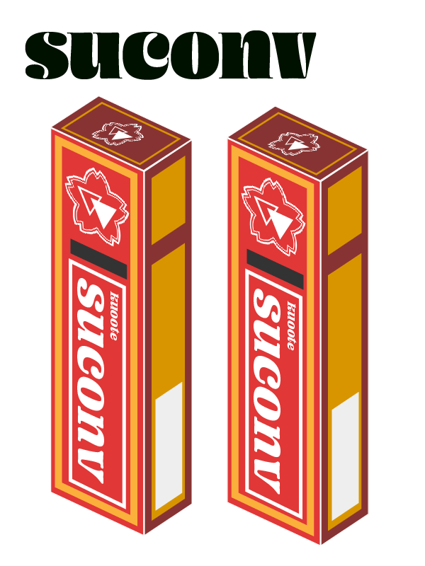

# suconv

This is SKK like ddc source.

Project name by @raa0121

Logo by @peacock0803sz thanks.

inspired by
[asyncomplete-skk](https://github.com/mattn/asyncomplete-skk.vim)([article](https://zenn.dev/mattn/articles/5a84f6a09f907c374577))

this plugin is incomplete. please see example.vim

# LICENSE

zlib
